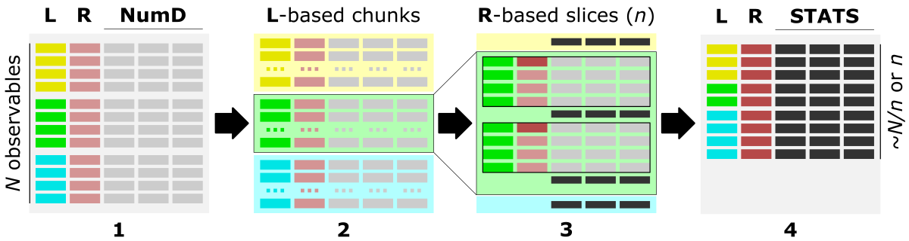
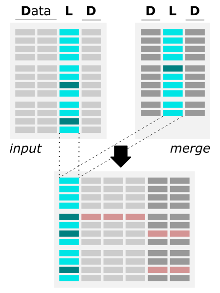

# data_wrangling
The **data_wrangling** repo collects Python mini-apps for popular tasks in the data processing.

Each application is placed in a separate directory for the tidy organization where you can find:
- the python script (.py) of the application
- the example inputs
- the documentation in the README.md file, including some example usage variations

All the applications have a **built-in set of options** provided as in-line arguments from the command line. Thanks to that, there is **no need to modify source code** by the user (e.g., to replace input filename or tune params). Also, it makes the apps more universal, comprehensive, and robust.

More advanced (multi-purpose or multi-options) applications have a **built-in logger** which reports the analysis progress with the details depending on the **selected verbosity level**.

# Getting started

**env = environment**

To get started, please visit the <a href="https://datascience.101workbook.org/07-DataParsing/03-DATA-WRANGLING-APPS/00-data-wrangling-apps" target="_blank">Data Wrangling: use ready-made apps  ⤴</a> section in the <a href="https://datascience.101workbook.org" target="_blank">Data Science Workbook  ⤴</a>. In the practical tutorial, you will find all the information you need to set up a <a href="https://datascience.101workbook.org/07-DataParsing/03-DATA-WRANGLING-APPS/00-data-wrangling-apps#environment-setup" target="_blank">universal conda environment  ⤴</a> that works for all the applications present in the **data_wrangling repository**. It is the first step to create your computational environment and familiarize yourself with the tools and techniques used in the data wrangling process.

While the tutorial provides you with detailed instructions with explanations, **below you can find a code snippets** that aggregates all the necessary commands to get you started (*recommended for Conda-experienced or returning users*):

<div style="background: mistyrose; padding: 15px; margin-bottom: 20px;">
<span style="font-weight:800;">WARNING:</span>
<br><span style="font-style:italic;"> Here we assume that you have conda installed. Otherwise, make up for it by going to workbook's section <a href="https://datascience.101workbook.org/07-DataParsing/03-DATA-WRANGLING-APPS/00-data-wrangling-apps#environment-setup" target="_blank">Environment setup  ⤴</a>. <br>
On HPC systems, conda can usually be loaded from the module manager:<br>
<code>module load conda</code>
</span>
</div><br>


**Create new Conda environment** *(do it only once on a given computing machine)*
```
conda create -n data_wrangling python=3.9
```

**Activate Conda environment** *(do it in every new seesion to run data_wrangling apps)*

```
conda activate data_wrangling
```
*^ On some HPC systems, replacing the `conda` keyword with `source` is needed.*

**Install basic dependencies within environment** *(do it only once at the initial creation of the conda env)*

```
pip install pandas
pip install numpy
pip install openpyxl
```
*^ Some applications may have additional requirements listed at the top of the corresponding README file in the application's folder. When necessary, you can install them in the conda environment using the `pip` command.*

**Deactivate Conda environment** *(do it to 'close' env once you are done with running the data_wrangling apps)*

```
conda deactivate
```
*^ On some HPC systems, replacing the `conda` keyword with `source` is needed.*

**List all your conda envs** *(do it when you can't remember* ☺ *the name of the env you need)*

```
conda info -e
```

# Overview of available applications

## bin_data app

The application enables grouping/slicing of the data as the ensembles of rows and aggregates observables from the numerical columns by calculating the sum or mean in each group/slice.

* **app in the repo:** <a href="https://github.com/ISUgenomics/data_wrangling/tree/main/bin_data" target="_blank">ISUgenomics/data_wrangling/<b>bin_data</b>  ⤴</a>

* **docs:** <a href="https://github.com/ISUgenomics/data_wrangling/tree/main/bin_data#overview" target="_blank">README  ⤴</a>

* **tutorial:** <a href="https://datascience.101workbook.org/07-DataParsing/03-DATA-WRANGLING-APPS/02-slice-or-bin-data-py" target="_blank">DataScience_Workbook/07. Data Acquisition and Wrangling/Data Wrangling/<b>Aggregate data over slicing variations</b>  ⤴</a>

<br>
<i>The figure shows the main steps of the bin_data algorithm. First, you can group data by unique values in the <b>L</b>abel column creating data chunks (marked as different background colors at step 2). Each data chunk can be further sliced based on the value ranges of the numerical data stored in <b>R</b>anges column (see step 3). Finally, you can aggreagte data of each slice to a single value, which can represent the sum or average of the aggreagted values, separately for each of the STATS column ( see step 4).</i>

---

## data_merge app

The application enables the merging of two (or multiple) files by matching column (*column with the same values in all merged files*) and assigning custom *error_value* for missing records (from any file).

* **app in the repo:** <a href="https://github.com/ISUgenomics/data_wrangling/tree/main/merge_data" target="_blank">ISUgenomics/data_wrangling/<b>merge_data</b>  ⤴</a>

* **docs:** <a href="https://github.com/ISUgenomics/data_wrangling/tree/main/merge_data#overview" target="_blank">README  ⤴</a>

* **tutorial:** <a href="https://datascience.101workbook.org/07-DataParsing/03-DATA-WRANGLING-APPS/01-merge-data-py" target="_blank">DataScience_Workbook/07. Data Acquisition and Wrangling/Data Wrangling/<b>Merge files by common column</b>  ⤴</a>

<table>
  <tr> <td>
        <br>
       </td> <td> <b>APP FEATURES:</b><br><br>
        <li> merging files of the <b>same or different format</b>,<br>
        <i>i.e., with different column headers or different column order </i><br><br>
        <li> merging files separated by <b>different delimiters</b>
        <i>(including Excel .xlsx files)</i><br><br>
        <li> merging <b>multiple files all at once</b><br><br>
        <li> <b>keeping only selected columns</b> during the merge
        <i>(the same or different columns from files) </i><br><br>
        <li> providing <b>custom <i>error_value</i></b> for missing data
    </td> </tr>
</table>

<i>The figure shows the algorithm of merging two files by common column. The dark teal color corresponds to the record available only in the one of input files. The red color corresponds to the missing records (error_value) in the merged output.</i>

---
