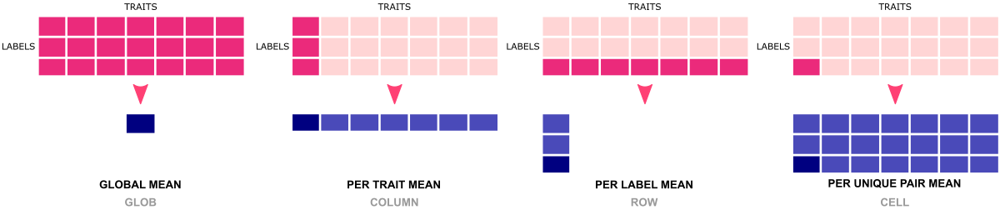

# Overview

The **value-to-color mapping** applications are written in Python3 and employ  efficient libraries [pandas and numpy] for operating on a complex data structure. The application **assigns colors** to value ranges/intervals. There are various variants of value-to-color mapping possible to set up by a combination of available options.

Value-to-color mapping facilitates:
- meaningful visualization of the results
- detecting regions/ranges enriched or depleted by the feature

## Algorithm

<b>The numerical values (from selected columns) are replaced by the corresponding discrete colors. </b>


### Variants of value-to-color mapping

To convert numerical values into colors, some premises must be made. For example, decide whether the **range of values** will be determined for each column separately or whether you collect all numerical results into a single pool. You must also decide what **statistical metric** will be your reference for sizing intervals on the color scale. Of course, the answers to these questions can strongly depend on the **type of data**. Thus, the application has a set of options that give a lot of freedom in this regard.

**First, specify a range of values** <br>
`-t {glob,column,row,cell}` <br>
Looking at your data, decide whether you want to operate on a unified pool of values from the entire matrix [`glob`], or whether you need separate subsets for unique labels in rows [`row`] or traits in columns [`column`] or label-trait pairs [`cell`].



**Then, select statistical metric as a reference for the center of the color scale** <br>
`-m {max,mean,median}` <br>
The algorithm finds the minimum, maximum, mean, and standard deviation values for the selected type of data grouping (*see previous step*). All statistics are print on the standard output for future reference (*if needed*). The user-selected metric (**mean, median, or half-max**) is assigned to the color corresponding to the center of the color scale. Then, it adjusts values between minimum and *metric* for the lower part of the color scale and values between *metric* and maximum for the upper part of the color scale.

***WARNING!*** <br>
Look at the histogram of your data to see the shape of the distribution of values. If you detect **skewness**, and still want to use standard deviation to create color intervals, first normalize your data. Thanks to that, you will get more normal-like distribution and standard deviation will no longer be outside the range of values.


**Finally, provide intervals for value-to-color mapping** <br>
`-s {'std',intervals}` <br>
The number of value ranges should correspond to the number of colors used. By default, the value range for a given color (*^ in 3-color scale variant only*) depends on the standard deviation `'std'`. Alternatively, when you need more complex color scale, provide a comma-separated list of metric's multipliers. For example, `"0.2,0.5,1.0,1.2,1.5"` will create five value intervals: `[color_1] < 0.2 * metric < [color_2] < 0.5 * metric < [color_3] < 1.0 * metric < [color_4] < 1.2 * metric < [color_5] < 1.5 * metric` *(metric: mean, median, or half of the maximum)*.


# (1) assign_colors.py app (python)

The application **converts numerical values to colors** using customizable color scales. The returned output **keeps the the data structure of the user-provided input**. The selected numerical columns (by default all numerical columns) are mapped to colors and the remamining columns (e.g., labels, annotations) are copied unchanged. Besides value-to-color mapping, another important feature of this app is an **automatic generation of highly customizable color scales**. They can later be used independently with various visualization applications (e.g., plotly-based Python web apps, to learn more see <a href="https://datascience.101workbook.org/08-DataVisualization/02-GRAPHS/02-PYTHON/05-plotly-examples-in-jupyterlab" target="_blank">Plotly Graphing (JupyterLab examples)  ⤴</a> in the <a href="https://datascience.101workbook.org" target="_blank">Data Science Workbook  ⤴</a>).

## Requirements

* `pandas`
* `numpy`

<i>^ included in the generic version of <b>data_wrangling</b> Conda environment<br>
<b>Learn more</b> from the <a href="https://datascience.101workbook.org/07-DataParsing/03-DATA-WRANGLING-APPS/00-data-wrangling-apps" target="_blank">Data Wrangling: use ready-made apps  ⤴</a> tutorial in the <a href="https://datascience.101workbook.org" target="_blank">Data Science Workbook  ⤴</a>.
</i>

## Options of ***assign_colors.py***

help & info arguments:
```
  -h,         --help                    # show full help message and exit
```

required arguments: *None* *(run without arguments returns the default color scale)*


optional arguments:
```
-cs colorscale, --colorscale CS         # [string] select colorscale type: provide pre-defined keyword (e.g., 'full', 'grey') or comma-separated list of colors (learn more from the docs)
-csp cs_params, --colorscale-params CSP # [string] adjust custom colorscale: comma-separated list of 6 parameters in order (1) number of colors, (2) color lightness, (3) color saturation, (4) color transparency, (5) whether to convert colors to HEX notation, (6) reverse color scale order
-i input,     --data-source input       # [string] input multi-col text file
-l label,     --labels-col label        # [int]    index of column with labels
-v vals, --values-col vals              # [string] comma-separated list of indices of numerical columns to have color assigned
-m type, --measure type                 # {max,mean,median} select type of measure for the colorscale  reference:
                                          - 'max' (half of the maximum value is the center of the colorscale) or
                                          - 'mean' (mean as the center of the colorscale) or
                                          - 'median' (meadian as the center of the colorscale)
-t type, --measure-type type            # {glob,row,column,cell} select type of measure:
                                          - 'glob' (stats over entire dataset) or
                                          - 'row' (stats per data row) or
                                          - 'column' (stats per data column) or
                                          - 'cell' (stats per row-col pair)
-s STEP, --step STEP                    # [string] provide color interval:
                                          - 'std' (standard deviation by default) or
                                          - comma-separated list of thresholds (e.g., 0.4,0.6,1.0)
```

*defaults for optional arguments:*
```
-cs 'grey'                          # means: the default (white-gray-black) scale is used
-csp '3,0.5,1.0,0.9,true,false'     # means: default color scale parameters are:
                                             (1) 3 color intervals are created
                                             (2) lightness for HLS color notation is set to 0.5 (original color); a lower value will darken the color and a higher value will lighten it; value should be a float in range 0.0 - 1.0
                                             (3) saturation for HLS color notation is set to 1.0 (original color); a lower value will add proportionally grey filter; value should be a float in range 0.0 - 1.0
                                             (4) color alpha is set to 0.9 (90% of solid color, 10% transparancy); value should be a float in range 0.0 (100% transparent) - 1.0 (100% solid color)
                                             (5) whether to convert colors to HEX notation (e.g., #FFFFFF for white); 'true' converts rgba notation to HEX annotation
                                             (6) whether to reverse color scale order; by default shades of selected color are created from darker to lighter; 'true' will reverse the color scale
-i ''                               # means: no input file will be loaded; it generates the customized color scale only
-l None                             # means: no input file is provided, and so no label column is specified
-v ''                               # means: all columns with numerical values will be mapped to colors
-m 'mean'                           # means: the mean value will be used as a center of the color scale
-t 'cell'                           # means: the measure will be calculated for each row x column pair in the matrix (input)
-s 'std'                            # means: standard deviation (std) determines the color intervals, i.e., black below [measure - std] and white above [measure + std];
                                             WARNING: when 'std' option is used only 3 first colors from the colorscale are used
```


## Example usage

```
python3 assign_colors.py [-cs colorscale] [-csp colorscale_params]
                   [-i input] [-l label_column]
                   [-v cols_for_mapping]
                   [-m {max,mean,median}] [-t {glob,row,column,cell}] [-s intervals]
                   [-h]
```

*^ arguments provided in square brackets [] are optional*


### **[1] example usage with minimal required options**
* <i> generates default color scale</i>

run in the terminal:
```
python3 assign_colors.py
```
**STANDARD OUTPUT** <br>

<details><summary>Help message</summary>

```
usage: assign_colors.py [-h] [-cs CS] [-csp CSP] [-i input] [-l label] [-v vals] [-m {max,mean,median}]
                        [-t {glob,row,column,cell}] [-s STEP]

Value-to-color mapping using customized color scales.

Requirements: python3, pandas, numpy

optional arguments:
  -h, --help            show this help message and exit
  -cs CS, --colorscale CS
                        select colorscale type: provide pre-defined keyword (e.g., 'full', 'grey') or comma-separated list of colors (learn more from the docs)
  -csp CSP, --colorscale-params CSP
                        adjust custom colorscale: comma-separated list of 6 parameters in order (1) number of colors, (2) color lightness, (3) color saturation, (4) color transparency, (5) whether to convert colors to HEX notation, (6) reverse color scale order
  -i input, --data-source input
                        [string] input multi-col file
                        -l label, --labels-col label
                                              [int] index of column with labels
                        -v vals, --values-col vals
                                              [string] list of indices of numerical columns to have color assigned
                        -m {max,mean,median}, --measure {max,mean,median}
                                              select type of color reference: 'max' (maximum value) or 'mean' or 'median'
                        -t {glob,row,column,cell}, --measure-type {glob,row,column,cell}
                                              select type of measure: 'glob' (stats over entire dataset) or 'row' (stats per data row) or 'col' (stats per data column) or 'cell' (stats per row-col pair)
                        -s STEP, --step STEP  provide color interval: 'std' (standard deviation by default) or comma-separated list of thresholds (e.g., 0.4,0.6,1.0)
USAGE:

        e.g., minimal required inputs:
                python3 assign_colors.py
        e.g., create custom color scale only:
                python3 assign_colors.py -cs 'red' -csp '9,0.5,1.0,0.9,true,false'
        e.g., value-to-color mapping with the default grey scale:
                python3 assign_colors.py -i input_file.csv -l 0


Use built-in colors (as keywords) or corresponding floats to generate custom color scale:
'red': 0,               'vermilion': 0.5,               'orange': 1,            'golden': 1.5,
'yellow': 2,            'yellowish': 2.5,               'chartreuse': 3,        'leaf': 3.5,
'green': 4,             'cobalt_green': 4.5,            'emerald': 5,           'turquoise': 5.5,
'cyan': 6,              'cerulean': 6.5,                'azure': 7,             'blue': 7.5,
'ultramarine': 8,       'hyacinth': 8.5,                'violet': 9,            'purple': 9.5,
'magenta': 10,          'reddish_purple': 10.5,         'crimson': 11,          'carmine': 11.5
```
</details>


```
COLOR SCALE: ['#000000', '#7f7f7f', '#ffffff']
```

**GRAPHIC FILE** `cs.png`


*The app, when run without any arguments, prints to the standard output 1) the help message, and 2) the default black-gray-white colorscale as a list of colors in HEX notation. The graphical representation of the color scale is automatically saved in the `cs.png` file for the visual inspection.*

### **[2] example usage variations to create custom color scale** *(color scale only)*
* <i> generates customized color scale for general usage</i>

To create customized color scale you have to adjust arguments of two option flags: `-cs` and `-csp`.

The `-cs` sets the general type of the color scale and accepts several string-like arguments:
* 'grey' - uses the default black-grey-white color scale
* 'full' - creates the rainbow color scale made up of N discrete colors
* 'red' - creates the shades scale (black-color-white) of color selected from the list of built-in color keys (*see the list below*)
* 'orange,red,magenta,crimson' - creates color scale using list of user-selected built-in color keys
* '2,3,4.5,5.5' - creates color scale using list of user-selected numerical values assigned to built-in color keys
* '#3f0000,#7f0000,#bf0000,#ff0000,#ff3f3f,#ff7f7f' - creates color scale using list of user-provided colors in HEX notation

DEFAULT: 'grey'

Use built-in colors (as keywords) or corresponding floats to generate custom color scale:
```
'red': 0,               'vermilion': 0.5,               'orange': 1,            'golden': 1.5,
'yellow': 2,            'yellowish': 2.5,               'chartreuse': 3,        'leaf': 3.5,
'green': 4,             'cobalt_green': 4.5,            'emerald': 5,           'turquoise': 5.5,
'cyan': 6,              'cerulean': 6.5,                'azure': 7,             'blue': 7.5,
'ultramarine': 8,       'hyacinth': 8.5,                'violet': 9,            'purple': 9.5,
'magenta': 10,          'reddish_purple': 10.5,         'crimson': 11,          'carmine': 11.5
```


The `-csp` option adjust the selected color scale to user needs by tuning up to six ordered parameters:
`N,L,S,A,H,R`
* (1) **N** - number of discrete colors in the color scale
* (2) **L** - lightness of the colors defined in the HLS notation; float value in [0,1] range; default is set to 0.5 which denotes original bright color
* (3) **S** - saturation of the colors defined in the HLS notation; float value in [0,1] range; default is set to 1.0 which denotes original bright color; decreasing the value increases the grey filter [see usage **example C**]
* (4) **A** - alpha of the colors; float value in [0,1] range; default is set to 0.9 which denotes 90% of solid color and 10% transparency
* (5) **H** - whether to convert colors to HEX notation (e.g., #FFFFFF for white); 'true' converts rgba notation to HEX annotation
* (6) **R** - whether to reverse color scale order; by default shades of selected color are created from darker to lighter; 'true' will reverse the color scale

DEAFULT: `'3,0.5,1.0,0.9,true,false'` <br>
*^ if you want to alter only selected params, leaving empty the remaining fields will keep their default values* <br>
*e.g., `'9,,,,,true'` creates 9-color scale with reversed order of colors with all other params being the defaults*

**A. Create shades of the selected color** *(from darker to lighter)* <br>

<details style="background-color:#f6feff; padding: 0.5em;"><summary style="color:#ff3870;">expand example</summary>

<br>
Creating color scale composed by shades of selected color, means that the original color is set in the middle of the scale and its darker shades (up to black) are added to the one end of the scale while its lighter shades (up to white) are added on the other end of the scale. Shades are generated automatically depending on the user-provided number of discrete colors expected in the color scale. The <b>lightness levels</b> of the user-selected built-in color <b>are set automatically</b> (<i>to create linear steps of the color shades</i>), thus the change in the <b>lightness (L) parameter</b> (second param in the <code>-csp</code> option) <b>has no effect</b>.

run in the terminal:
```
python3 assign_colors.py -cs 'red' -csp '9,,,,,'
```
equal using defaults for the remaining params:
```
python3 assign_colors.py -cs 'red' -csp '9,0.5,1.0,0.9,true,false'
```

**STANDARD OUTPUT** <br>
```
COLOR SCALE: ['#000000', '#3f0000', '#7f0000', '#bf0000', '#ff0000', '#ff3f3f', '#ff7f7f', '#ffbfbf', '#ffffff']
```

**GRAPHIC FILE**  `cs.png`


*The app generates color scale based on the built-in `red` color which is set in the middle of the scale. The number of color intervals is set as the **first** parameter for the `-scp` option. We requested the 9-color scale. The remaining 5 parameters have default values.*

</details><br>

**B. Create reverse-ordered shades of the selected color** *(from lighter to darker)*<br>

<details style="background-color:#f6feff; padding: 0.5em;"><summary style="color:#ff3870;">expand example</summary>

<br>

run in the terminal:
```
python3 assign_colors.py -cs 'red' -csp '9,,,,,true'
```

**STANDARD OUTPUT** <br>
```
COLOR SCALE: ['#ffffff', '#ffbfbf', '#ff7f7f', '#ff3f3f', '#ff0000', '#bf0000', '#7f0000', '#3f0000', '#000000']
```

**GRAPHIC FILE**  `cs.png`


*The app generates the same color scale of `red` shades as in the example A. This time the order of colors is reversed (from lighter to darker) by changing the **6-th** parameter of the `-csp` option to `true`.*

</details><br>


**C. Adjust saturation (grey filter) on the color scale** <br>

<details style="background-color:#f6feff; padding: 0.5em;"><summary style="color:#ff3870;">expand example</summary>

<br>

run in the terminal:
```
python3 assign_colors.py -cs 'red' -csp '9,,0.2,,,true'
```

**STANDARD OUTPUT** <br>
```
COLOR SCALE: ['#ffffff', '#e5d8d8', '#cbb2b2', '#b28c8c', '#996666', '#724c4c', '#4c3333', '#261919', '#000000']
```

**GRAPHIC FILE**  `cs.png`


*The app still uses the `red` color base for the color scale (as in examples A, B). This time we altered the **third** parameter of the `-csp` option which corresponds to the saturation level. By default, the maximum of 1.0 is set which provides the original (bright) color. As this value decreases (here to 0.2), the proportion of grey filter increases.*

</details><br>

**D. Print color scale in the RGBA notation** *(instead of HEX notation)*<br>

<details style="background-color:#f6feff; padding: 0.5em;"><summary style="color:#ff3870;">expand example</summary>

<br>

run in the terminal:
```
python3 assign_colors.py -cs 'red' -csp '9,,.2,,false,true'
```

**STANDARD OUTPUT** <br>
```
COLOR SCALE: ['rgba(255, 255, 255, 0.9)', 'rgba(229, 216, 216, 0.9)', 'rgba(203, 178, 178, 0.9)', 'rgba(178, 140, 140, 0.9)', 'rgba(153, 102, 102, 0.9)', 'rgba(114, 76, 76, 0.9)', 'rgba(76, 51, 51, 0.9)', 'rgba(38, 25, 25, 0.9)', 'rgba(0, 0, 0, 0.9)']
```

*The app still uses the `red` color base for the color scale (as in examples A, B, and C). This time we altered the **fifth** parameter of the `-csp` option which determines whether the colorscale is returned in the HEX notation. By default, the `true` value is set. As this value changes to `false`, the color scale is printed in the RGBA notation.*

</details><br>

**E. Create color scale made up of several built-in colors** <br>

<details style="background-color:#f6feff; padding: 0.5em;"><summary style="color:#ff3870;">expand example</summary>

<br>

If you need a color scale made of several clearly distinguishable colors (*instead of shades of a single color*) you can provide a list of built-in color keys (or their float equivalents). Note that in this case, the color scale is composed of X colors directly specified by the user and the first parameter (*N*) of the `-csp` option has no effect.

run in the terminal:
```
python3 assign_colors.py -cs 'yellow,red,cyan,magenta,leaf,orange'
```
equal using floats corresponding to the built-in color keys:
```
python3 assign_colors.py -cs '2,0,6,10,3.5,1'
```

**STANDARD OUTPUT** <br>
```
COLOR SCALE: ['#feff00', '#ff0000', '#00feff', '#ff00fe', '#3fff00', '#ff7f00']
```

**GRAPHIC FILE**  `cs.png`


In this case, you can further adjust all the color scale parameters available with option `-csp`, including *lightness*, *saturation*, and *alpha-transparency*.

* decrease / increase lightness (*second param of the `-csp` option*)
```
python3 assign_colors.py -cs '2,0,6,10,3.5,1' -csp ',0.2,,,,'
```
`COLOR SCALE: ['#656600', '#660000', '#006566', '#660065', '#196600', '#663300']`

```
python3 assign_colors.py -cs '2,0,6,10,3.5,1' -csp ',0.8,,,,'
```
`COLOR SCALE: ['#feff99', '#ff9999', '#99feff', '#ff99fe', '#b2ff99', '#ffcc99']`


* decrease saturation (*third param of the `-csp` option*)
```
python3 assign_colors.py -cs '2,0,6,10,3.5,1' -csp ',,0.5,,,'
```
`COLOR SCALE: ['#bfbf3f', '#bf3f3f', '#3fbfbf', '#bf3fbf', '#5fbf3f', '#bf7f3f']`


* increase transparency (*fourth param of the `-csp` option*)
```
python3 assign_colors.py -cs '2,0,6,10,3.5,1' -csp ',,,0.2,,'
```
`COLOR SCALE: ['#feff00', '#ff0000', '#00feff', '#ff00fe', '#3fff00', '#ff7f00']`


* reverse color order (*fourth param of the `-csp` option*)
```
python3 assign_colors.py -cs '2,0,6,10,3.5,1' -csp ',,,,,true'
```
`COLOR SCALE: ['#ff7f00', '#3fff00', '#ff00fe', '#00feff', '#ff0000', '#feff00']`


* apply several effects all at once
```
python3 assign_colors.py -cs '2,0,6,10,3.5,1' -csp ',0.5,0.5,0.5,,true'
```
`COLOR SCALE: ['#bf7f3f', '#5fbf3f', '#bf3fbf', '#3fbfbf', '#bf3f3f', '#bfbf3f']`


</details></br>

**F. Create rainbow color scale** <br>

<details style="background-color:#f6feff; padding: 0.5em;"><summary style="color:#ff3870;">expand example</summary>

<br>

If you like color scales with rainbow-like order of colors, then you should use a keyword `'full'` with option `-cs`. This will automatically pick the colors from the available distribution. The number of discrete colors depends on the user-provided parameter N (the first parameter) with the `-csp` option. Note that rainbow-like color scale can be adjusted with all the params of the `-csp` option (including lightness, saturation, alpha-transparency, and reversing the order of colors).

run in the terminal:
```
python3 assign_colors.py -cs 'full' -csp '12,,,,,'
```

**STANDARD OUTPUT** <br>
```
COLOR SCALE: ['#ff0000', '#ff8400', '#f5ff00', '#71ff00', '#00ff12', '#00ff96', '#00e3ff', '#005fff', '#2500ff', '#a900ff', '#ff00d0', '#ff004c']
```

**GRAPHIC FILE**  `cs.png`


</details><br>


**G. Create fully customized color scale made of user-provided colors** <br>

<details style="background-color:#f6feff; padding: 0.5em;"><summary style="color:#ff3870;">expand example</summary>

<br>

If you want to re-create the specific color scale (*e.g., from the past project*), you have to know *apriori* the color codes you want to use. In this case, color codes in HEX notation have to be provided as a comma-separated list with the `-cs` option. Note that such a color scale can NOT be further adjusted with params of the `-csp` option. However, with this usage scenario you can easily merge several color-shade scales (*e.g., red and blue like here*).

run in the terminal:
```
python3 assign_colors.py -cs '#bf0000,#ff0000,#ff3f3f,#ff7f7f,#ffbfbf,#ffffff,#bfcfff,#7f9fff,#3f6fff,#003fff,#002fbf'
```

**STANDARD OUTPUT** <br>
```
COLOR SCALE: ['#bf0000', '#ff0000', '#ff3f3f', '#ff7f7f', '#ffbfbf', '#ffffff', '#bfcfff', '#7f9fff', '#3f6fff', '#003fff', '#002fbf']
```

**GRAPHIC FILE**  `cs.png`


</details>


### **[3] example usage of the default value-to-color mapping with the default grey scale**
* <i> generates value-to-color mapping for general usage</i>


run in the terminal:
```
python3 assign_colors.py -i input_file.csv -l 0
```
equal using all default options:
```
python3 assign_colors.py -i input_file.csv -l 0 -v '' -m 'mean' -t 'cell' -s 'std' -cs 'grey' -csp '3,0.5,1.0,0.9,true,false'
```

**STANDARD OUTPUT** <br>

*By default with value-to-color mapping, statistics from all numeric columns are returned to the standard output. The statistics include 5 metrics: minimum, maximum, mean, median, and standard deviation. Every metric is calculated in a few grouping variants and returned as metrices: per COLUMN (which makes it easy to extract GLOBAL value) and per row-column [unique label-trait pairs] (which provides explicit values for CELL type of data slicing and makes it easy to extract per ROW, i.e. unique label value).*

<details><summary>expand content</summary>

```
COLOR SCALE: ['#000000', '#7f7f7f', '#ffffff']

#-OVARALL STATS:
 KEYS:      val-2      val-3      val-4      val-5      val-6      val-7      val-8      val-9
 MINI:      0.076        0.0        0.0        0.0        0.0        0.0        0.0        0.0
 MAXI:     35.148     26.726      5.429      4.161     24.516      43.47       5.13      6.168
 MEAN:      2.939      2.545      0.836      0.721       2.64       2.51      0.822      0.835
 MEDI:      1.159      0.962      0.426      0.353      0.944      0.994      0.258      0.251
 STDV:      5.336      4.503        1.0      0.933       4.09      6.219      1.126      1.355

#-MINI IN GROUPS =  0.0
              label  val-2  val-3  val-4  val-5  val-6  val-7  val-8  val-9
0   HiC_scaffold_1  0.107  0.000  0.000  0.000  0.206  0.007  0.000  0.000
1   HiC_scaffold_2  0.417  0.768  0.142  0.000  0.608  0.327  0.039  0.213
2   HiC_scaffold_3  0.643  0.885  0.493  0.202  0.891  0.980  0.083  0.240
3   HiC_scaffold_4  1.849  2.601  0.547  1.021  3.253  1.890  0.482  0.588
4   HiC_scaffold_5  0.522  0.928  0.285  0.105  0.558  0.204  0.109  0.148
5   HiC_scaffold_6  0.486  0.146  0.117  0.040  0.251  0.412  0.000  0.035
6   HiC_scaffold_7  0.076  0.000  0.000  0.000  0.000  0.000  0.000  0.000
7   HiC_scaffold_8  3.874  6.496  1.576  1.318  3.908  4.366  1.827  1.184
8   HiC_scaffold_9  1.848  2.576  0.541  0.235  2.271  1.207  0.234  0.256
9  HiC_scaffold_10  0.772  0.751  0.135  0.000  0.117  0.000  0.242  0.000

#-MAXI IN GROUPS =  43.47
              label   val-2   val-3  val-4  val-5   val-6   val-7  val-8  val-9
0   HiC_scaffold_1   3.458   1.908  0.417  0.438   0.895   1.593  0.831  1.030
1   HiC_scaffold_2  35.148  26.726  5.429  3.047  24.516  43.470  5.130  6.168
2   HiC_scaffold_3   6.301   4.692  1.977  2.135   4.320   4.662  2.965  2.122
3   HiC_scaffold_4   4.742   3.612  1.447  1.268   4.543   3.740  2.980  2.409
4   HiC_scaffold_5   5.242   3.800  2.159  1.133   4.691   5.975  2.260  1.209
5   HiC_scaffold_6   1.613   1.724  1.438  0.802   2.353   1.561  0.657  0.785
6   HiC_scaffold_7   2.184   2.173  1.490  1.444   2.477   2.708  1.646  1.141
7   HiC_scaffold_8   9.339  14.601  2.804  3.357  10.015   6.917  2.757  3.896
8   HiC_scaffold_9   9.472  10.185  2.304  2.276   9.641   5.288  2.242  2.611
9  HiC_scaffold_10   8.198   7.925  2.741  4.161   9.405   8.641  2.951  6.093

#-MEAN IN GROUPS =  1.731
              label  val-2   val-3  val-4  val-5  val-6  val-7  val-8  val-9
0   HiC_scaffold_1  1.024   0.630  0.217  0.177  0.499  0.772  0.193  0.290
1   HiC_scaffold_2  8.861   6.715  1.730  1.044  6.659  9.545  1.275  1.763
2   HiC_scaffold_3  2.216   1.881  1.054  0.775  2.321  2.269  0.950  0.917
3   HiC_scaffold_4  3.296   3.107  0.997  1.144  3.898  2.815  1.731  1.498
4   HiC_scaffold_5  2.307   2.188  0.746  0.488  1.929  2.075  0.831  0.622
5   HiC_scaffold_6  1.048   0.762  0.493  0.432  1.260  0.897  0.300  0.354
6   HiC_scaffold_7  0.564   0.535  0.414  0.357  0.528  0.544  0.251  0.159
7   HiC_scaffold_8  6.607  10.549  2.190  2.338  6.962  5.641  2.292  2.540
8   HiC_scaffold_9  6.447   6.728  1.494  1.475  6.529  3.810  1.427  1.653
9  HiC_scaffold_10  4.692   2.594  1.123  1.285  4.469  2.671  1.726  1.461

#-MEDI IN GROUPS:
              label  val-2   val-3  val-4  val-5  val-6  val-7  val-8  val-9
0   HiC_scaffold_1  0.697   0.605  0.221  0.155  0.432  0.684  0.054  0.178
1   HiC_scaffold_2  1.933   0.995  0.942  0.431  3.196  1.008  0.191  0.740
2   HiC_scaffold_3  0.960   0.974  0.873  0.381  2.037  1.718  0.376  0.654
3   HiC_scaffold_4  3.296   3.107  0.997  1.144  3.898  2.815  1.731  1.498
4   HiC_scaffold_5  1.822   1.904  0.340  0.470  1.670  1.377  0.528  0.647
5   HiC_scaffold_6  1.222   0.598  0.304  0.598  1.345  0.934  0.246  0.245
6   HiC_scaffold_7  0.398   0.331  0.211  0.108  0.344  0.388  0.015  0.000
7   HiC_scaffold_8  6.607  10.549  2.190  2.338  6.962  5.641  2.292  2.540
8   HiC_scaffold_9  8.021   7.424  1.638  1.914  7.675  4.935  1.806  2.093
9  HiC_scaffold_10  6.404   1.039  1.019  0.927  5.883  1.749  2.127  0.186

#-STDV IN GROUPS:
              label   val-2   val-3  val-4  val-5   val-6   val-7  val-8  val-9
0   HiC_scaffold_1   1.079   0.627  0.147  0.166   0.227   0.518  0.300  0.338
1   HiC_scaffold_2  14.828  11.277  2.177  1.227  10.065  18.980  2.183  2.516
2   HiC_scaffold_3   2.729   1.874  0.671  0.915   1.446   1.684  1.361  0.837
3   HiC_scaffold_4   2.046   0.715  0.636  0.175   0.912   1.308  1.766  1.288
4   HiC_scaffold_5   1.854   1.207  0.800  0.418   1.650   2.311  0.896  0.438
5   HiC_scaffold_6   0.484   0.615  0.543  0.359   0.833   0.483  0.252  0.313
6   HiC_scaffold_7   0.583   0.625  0.524  0.548   0.666   0.761  0.485  0.341
7   HiC_scaffold_8   3.864   5.731  0.868  1.442   4.318   1.804  0.658  1.918
8   HiC_scaffold_9   4.048   3.852  0.890  1.089   3.816   2.261  1.056  1.238
9  HiC_scaffold_10   3.437   3.040  1.005  1.683   3.859   3.440  1.107  2.612
```

</details><br>

**GRAPHIC FILE**  `cs.png`


**OUTPUT DATA FILE**  `colors.csv` (*3-colors used only*)

```
label,position,val-2,val-3,val-4,val-5,val-6,val-7,val-8,val-9,count
HiC_scaffold_1,982.0-10982.0,#7f7f7f,#7f7f7f,#000000,#000000,#7f7f7f,#7f7f7f,#7f7f7f,#7f7f7f,#7f7f7f
HiC_scaffold_1,10982.0-20982.0,#7f7f7f,#7f7f7f,#7f7f7f,#7f7f7f,#ffffff,#7f7f7f,#7f7f7f,#7f7f7f,#ffffff
HiC_scaffold_1,20982.0-30982.0,#7f7f7f,#000000,#000000,#7f7f7f,#7f7f7f,#7f7f7f,#7f7f7f,#7f7f7f,#7f7f7f
HiC_scaffold_1,30982.0-40982.0,#7f7f7f,#000000,#ffffff,#000000,#000000,#000000,#7f7f7f,#7f7f7f,#000000
HiC_scaffold_1,40982.0-50982.0,#7f7f7f,#7f7f7f,#7f7f7f,#7f7f7f,#7f7f7f,#7f7f7f,#7f7f7f,#ffffff,#7f7f7f
```

### **[4] example usage of default value-to-color mapping with custom color scale**
* <i> generates value-to-color mapping for general usage</i>

run in the terminal:
```
python3 assign_colors.py -i input_file.csv -l 0 -cs 'red' -csp '5,,0.5,,,'
```

**STANDARD OUTPUT** <br>

<details><summary>expand content</summary>

```
COLOR SCALE: ['#000000', '#5f1f1f', '#bf3f3f', '#df9f9f', '#ffffff']

#-OVARALL STATS:
 KEYS:      val-2      val-3      val-4      val-5      val-6      val-7      val-8      val-9
 MINI:      0.076        0.0        0.0        0.0        0.0        0.0        0.0        0.0
 MAXI:     35.148     26.726      5.429      4.161     24.516      43.47       5.13      6.168
 MEAN:      2.939      2.545      0.836      0.721       2.64       2.51      0.822      0.835
 MEDI:      1.159      0.962      0.426      0.353      0.944      0.994      0.258      0.251
 STDV:      5.336      4.503        1.0      0.933       4.09      6.219      1.126      1.355

#-MINI IN GROUPS =  0.0
              label  val-2  val-3  val-4  val-5  val-6  val-7  val-8  val-9
0   HiC_scaffold_1  0.107  0.000  0.000  0.000  0.206  0.007  0.000  0.000
1   HiC_scaffold_2  0.417  0.768  0.142  0.000  0.608  0.327  0.039  0.213
2   HiC_scaffold_3  0.643  0.885  0.493  0.202  0.891  0.980  0.083  0.240
3   HiC_scaffold_4  1.849  2.601  0.547  1.021  3.253  1.890  0.482  0.588
4   HiC_scaffold_5  0.522  0.928  0.285  0.105  0.558  0.204  0.109  0.148
5   HiC_scaffold_6  0.486  0.146  0.117  0.040  0.251  0.412  0.000  0.035
6   HiC_scaffold_7  0.076  0.000  0.000  0.000  0.000  0.000  0.000  0.000
7   HiC_scaffold_8  3.874  6.496  1.576  1.318  3.908  4.366  1.827  1.184
8   HiC_scaffold_9  1.848  2.576  0.541  0.235  2.271  1.207  0.234  0.256
9  HiC_scaffold_10  0.772  0.751  0.135  0.000  0.117  0.000  0.242  0.000

#-MAXI IN GROUPS =  43.47
              label   val-2   val-3  val-4  val-5   val-6   val-7  val-8  val-9
0   HiC_scaffold_1   3.458   1.908  0.417  0.438   0.895   1.593  0.831  1.030
1   HiC_scaffold_2  35.148  26.726  5.429  3.047  24.516  43.470  5.130  6.168
2   HiC_scaffold_3   6.301   4.692  1.977  2.135   4.320   4.662  2.965  2.122
3   HiC_scaffold_4   4.742   3.612  1.447  1.268   4.543   3.740  2.980  2.409
4   HiC_scaffold_5   5.242   3.800  2.159  1.133   4.691   5.975  2.260  1.209
5   HiC_scaffold_6   1.613   1.724  1.438  0.802   2.353   1.561  0.657  0.785
6   HiC_scaffold_7   2.184   2.173  1.490  1.444   2.477   2.708  1.646  1.141
7   HiC_scaffold_8   9.339  14.601  2.804  3.357  10.015   6.917  2.757  3.896
8   HiC_scaffold_9   9.472  10.185  2.304  2.276   9.641   5.288  2.242  2.611
9  HiC_scaffold_10   8.198   7.925  2.741  4.161   9.405   8.641  2.951  6.093

#-MEAN IN GROUPS =  1.731
              label  val-2   val-3  val-4  val-5  val-6  val-7  val-8  val-9
0   HiC_scaffold_1  1.024   0.630  0.217  0.177  0.499  0.772  0.193  0.290
1   HiC_scaffold_2  8.861   6.715  1.730  1.044  6.659  9.545  1.275  1.763
2   HiC_scaffold_3  2.216   1.881  1.054  0.775  2.321  2.269  0.950  0.917
3   HiC_scaffold_4  3.296   3.107  0.997  1.144  3.898  2.815  1.731  1.498
4   HiC_scaffold_5  2.307   2.188  0.746  0.488  1.929  2.075  0.831  0.622
5   HiC_scaffold_6  1.048   0.762  0.493  0.432  1.260  0.897  0.300  0.354
6   HiC_scaffold_7  0.564   0.535  0.414  0.357  0.528  0.544  0.251  0.159
7   HiC_scaffold_8  6.607  10.549  2.190  2.338  6.962  5.641  2.292  2.540
8   HiC_scaffold_9  6.447   6.728  1.494  1.475  6.529  3.810  1.427  1.653
9  HiC_scaffold_10  4.692   2.594  1.123  1.285  4.469  2.671  1.726  1.461

#-MEDI IN GROUPS:
              label  val-2   val-3  val-4  val-5  val-6  val-7  val-8  val-9
0   HiC_scaffold_1  0.697   0.605  0.221  0.155  0.432  0.684  0.054  0.178
1   HiC_scaffold_2  1.933   0.995  0.942  0.431  3.196  1.008  0.191  0.740
2   HiC_scaffold_3  0.960   0.974  0.873  0.381  2.037  1.718  0.376  0.654
3   HiC_scaffold_4  3.296   3.107  0.997  1.144  3.898  2.815  1.731  1.498
4   HiC_scaffold_5  1.822   1.904  0.340  0.470  1.670  1.377  0.528  0.647
5   HiC_scaffold_6  1.222   0.598  0.304  0.598  1.345  0.934  0.246  0.245
6   HiC_scaffold_7  0.398   0.331  0.211  0.108  0.344  0.388  0.015  0.000
7   HiC_scaffold_8  6.607  10.549  2.190  2.338  6.962  5.641  2.292  2.540
8   HiC_scaffold_9  8.021   7.424  1.638  1.914  7.675  4.935  1.806  2.093
9  HiC_scaffold_10  6.404   1.039  1.019  0.927  5.883  1.749  2.127  0.186

#-STDV IN GROUPS:
              label   val-2   val-3  val-4  val-5   val-6   val-7  val-8  val-9
0   HiC_scaffold_1   1.079   0.627  0.147  0.166   0.227   0.518  0.300  0.338
1   HiC_scaffold_2  14.828  11.277  2.177  1.227  10.065  18.980  2.183  2.516
2   HiC_scaffold_3   2.729   1.874  0.671  0.915   1.446   1.684  1.361  0.837
3   HiC_scaffold_4   2.046   0.715  0.636  0.175   0.912   1.308  1.766  1.288
4   HiC_scaffold_5   1.854   1.207  0.800  0.418   1.650   2.311  0.896  0.438
5   HiC_scaffold_6   0.484   0.615  0.543  0.359   0.833   0.483  0.252  0.313
6   HiC_scaffold_7   0.583   0.625  0.524  0.548   0.666   0.761  0.485  0.341
7   HiC_scaffold_8   3.864   5.731  0.868  1.442   4.318   1.804  0.658  1.918
8   HiC_scaffold_9   4.048   3.852  0.890  1.089   3.816   2.261  1.056  1.238
9  HiC_scaffold_10   3.437   3.040  1.005  1.683   3.859   3.440  1.107  2.612
```

</details><br>

**GRAPHIC FILE**  `cs.png`


**OUTPUT DATA FILE**  `colors.csv` (*5-colors used*)

```
label,position,val-2,val-3,val-4,val-5,val-6,val-7,val-8,val-9,count
HiC_scaffold_1,982.0-10982.0,#5f1f1f,#5f1f1f,#000000,#000000,#5f1f1f,#5f1f1f,#5f1f1f,#5f1f1f,#5f1f1f
HiC_scaffold_1,10982.0-20982.0,#5f1f1f,#5f1f1f,#5f1f1f,#5f1f1f,#bf3f3f,#5f1f1f,#5f1f1f,#5f1f1f,#bf3f3f
HiC_scaffold_1,20982.0-30982.0,#5f1f1f,#000000,#000000,#5f1f1f,#5f1f1f,#5f1f1f,#5f1f1f,#5f1f1f,#5f1f1f
HiC_scaffold_1,30982.0-40982.0,#5f1f1f,#000000,#bf3f3f,#000000,#000000,#000000,#5f1f1f,#5f1f1f,#000000
HiC_scaffold_1,40982.0-50982.0,#5f1f1f,#5f1f1f,#5f1f1f,#5f1f1f,#5f1f1f,#5f1f1f,#5f1f1f,#bf3f3f,#5f1f1f
...
```


### **[5] example usage of custom value-to-color mapping with custom color scale**
* <i> generates value-to-color mapping for general usage</i>

run in the terminal:
```
python3 assign_colors.py -i input_file.csv -l 0 -cs 'red' -csp '5,,0.5,,, -v 2,3,4 -m 'max' -t 'column' -s 0.25,0.5,1,1.5,2
```

**STANDARD OUTPUT** <br>

<details><summary>expand content</summary>

```
COLOR SCALE: ['#000000', '#5f1f1f', '#bf3f3f', '#df9f9f', '#ffffff']

#-OVARALL STATS:
 KEYS:      val-2      val-3      val-4
 MINI:      0.076        0.0        0.0
 MAXI:     35.148     26.726      5.429
 MEAN:      2.939      2.545      0.836
 MEDI:      1.159      0.962      0.426
 STDV:      5.336      4.503        1.0

#-MINI IN GROUPS =  0.0
              label  val-2  val-3  val-4
0   HiC_scaffold_1  0.107  0.000  0.000
1   HiC_scaffold_2  0.417  0.768  0.142
2   HiC_scaffold_3  0.643  0.885  0.493
3   HiC_scaffold_4  1.849  2.601  0.547
4   HiC_scaffold_5  0.522  0.928  0.285
5   HiC_scaffold_6  0.486  0.146  0.117
6   HiC_scaffold_7  0.076  0.000  0.000
7   HiC_scaffold_8  3.874  6.496  1.576
8   HiC_scaffold_9  1.848  2.576  0.541
9  HiC_scaffold_10  0.772  0.751  0.135

#-MAXI IN GROUPS =  35.148
              label   val-2   val-3  val-4
0   HiC_scaffold_1   3.458   1.908  0.417
1   HiC_scaffold_2  35.148  26.726  5.429
2   HiC_scaffold_3   6.301   4.692  1.977
3   HiC_scaffold_4   4.742   3.612  1.447
4   HiC_scaffold_5   5.242   3.800  2.159
5   HiC_scaffold_6   1.613   1.724  1.438
6   HiC_scaffold_7   2.184   2.173  1.490
7   HiC_scaffold_8   9.339  14.601  2.804
8   HiC_scaffold_9   9.472  10.185  2.304
9  HiC_scaffold_10   8.198   7.925  2.741

#-MEAN IN GROUPS =  2.106666666666667
              label  val-2   val-3  val-4
0   HiC_scaffold_1  1.024   0.630  0.217
1   HiC_scaffold_2  8.861   6.715  1.730
2   HiC_scaffold_3  2.216   1.881  1.054
3   HiC_scaffold_4  3.296   3.107  0.997
4   HiC_scaffold_5  2.307   2.188  0.746
5   HiC_scaffold_6  1.048   0.762  0.493
6   HiC_scaffold_7  0.564   0.535  0.414
7   HiC_scaffold_8  6.607  10.549  2.190
8   HiC_scaffold_9  6.447   6.728  1.494
9  HiC_scaffold_10  4.692   2.594  1.123

#-MEDI IN GROUPS:
              label  val-2   val-3  val-4
0   HiC_scaffold_1  0.697   0.605  0.221
1   HiC_scaffold_2  1.933   0.995  0.942
2   HiC_scaffold_3  0.960   0.974  0.873
3   HiC_scaffold_4  3.296   3.107  0.997
4   HiC_scaffold_5  1.822   1.904  0.340
5   HiC_scaffold_6  1.222   0.598  0.304
6   HiC_scaffold_7  0.398   0.331  0.211
7   HiC_scaffold_8  6.607  10.549  2.190
8   HiC_scaffold_9  8.021   7.424  1.638
9  HiC_scaffold_10  6.404   1.039  1.019

#-STDV IN GROUPS:
              label   val-2   val-3  val-4
0   HiC_scaffold_1   1.079   0.627  0.147
1   HiC_scaffold_2  14.828  11.277  2.177
2   HiC_scaffold_3   2.729   1.874  0.671
3   HiC_scaffold_4   2.046   0.715  0.636
4   HiC_scaffold_5   1.854   1.207  0.800
5   HiC_scaffold_6   0.484   0.615  0.543
6   HiC_scaffold_7   0.583   0.625  0.524
7   HiC_scaffold_8   3.864   5.731  0.868
8   HiC_scaffold_9   4.048   3.852  0.890
9  HiC_scaffold_10   3.437   3.040  1.005
```

</details><br>

**GRAPHIC FILE**  `cs.png`


**OUTPUT DATA FILE**  `colors.csv` (*5-colors used*)

```
label,position,val-5,val-6,val-7,val-8,val-9,count,val-2,val-3,val-4
HiC_scaffold_1,982.0-10982.0,0.0,0.38,0.822,0.074,0.359,1373,#000000,#000000,#000000
HiC_scaffold_1,10982.0-20982.0,0.326,0.895,1.057,0.0,0.456,2025,#000000,#000000,#000000
HiC_scaffold_1,20982.0-30982.0,0.052,0.507,0.378,0.0,0.085,672,#000000,#000000,#000000
HiC_scaffold_1,30982.0-40982.0,0.0,0.206,0.007,0.0,0.0,427,#000000,#000000,#000000
HiC_scaffold_1,40982.0-50982.0,0.228,0.41,1.276,0.151,1.03,1279,#000000,#000000,#000000
...
```


# (2) convert_for_ideogram.py app (python)

## Algorithm

<b>The numerical values (from selected columns) are replaced by the corresponding discrete colors. </b>


First, we find the minimum, maximum, mean, median, and standard deviation over the data set. Minimum and maximum determine the range of values mapped to the color scale. The center of the color scale can be a **metric**: *mean*, *median*, or *half of the maximum* value. The number of colors in the color scale and distribution of values assigned to them is customizable. <br>
By default, the 3-color scale: [1] *light gray* - [2] *gray* - [3] *black* is used, and the value thresholds between colors depends on the standard deviation `[1] < metric - std < [2] < metric + std < [3]`. <br>
If different value intervals are needed, they must be a comma-separated list of metric multipliers [M]. For example, "0.2,0.4,0.6,0.8,1.0" will create five value intervals: `[1] < 0.2 * metric < [2] < 0.4 * metric < [3] < 0.6 * metric < [4] < 0.8 * metric < [5] < 1.0 * metric` (*metric: mean, median, or half of the maximum*). When the number of provided multipliers is higher than 3, the built-in 9-color scale will be used (7 gray shades + pink + purple pattern). The **default 3- and 9-color scales** are intended for generating input file for **ideogram-JS** visualization.


 If you want to apply a **custom color scale**, the **ideogram-plotly** visualization app should be used instead. Then you can provide a comma-separated list of HEX colors (e.g., "#000000,#f6c5c5,#e66969,#d60c0c,#970000,#660000,#300000" for white - red - maroon shades). <br>
 Note the number and order of metric multipliers should match the number and order of colors (e.g., "0.25,0.5,0.75,1.0,1.25,1.5,2.0" multipliers for the red-shades color scale and half-max as a metric).

 

## Requirements

* `pandas`
* `numpy`

<i>^ included in the generic version of <b>data_wrangling</b> Conda environment<br>
<b>Learn more</b> from the <a href="https://datascience.101workbook.org/07-DataParsing/03-DATA-WRANGLING-APPS/00-data-wrangling-apps" target="_blank">Data Wrangling: use ready-made apps  ⤴</a> tutorial in the <a href="https://datascience.101workbook.org" target="_blank">Data Science Workbook  ⤴</a>.
</i>

## Options of ***convert_to_ideogram.py***

help & info arguments:
```
  -h,         --help                    # show full help message and exit
```

required arguments:
```
-i input,     --data-source input       # [string] input multi-col text file
-l label,     --labels-col label        # [int]    index of column with labels
-r range,     --ranges-col range        # [int]    index of column with ranges
```

optional arguments:
```
-a arm, --arms-col arm                  # [int]    index of column with chromosome arms annotation
-b band, --bands-col band               # [int]    index of column with bands annotation (names)
-v vals, --values-col vals              # [string] comma-separated list of indices of numerical columns to have color assigned
-m type, --measure type                 # {max,mean,median} select type of measure for the colorscale  reference:
                                          - 'max' (half of the maximum value is the center of the colorscale) or
                                          - 'mean' (mean as the center of the colorscale) or
                                          - 'median' (meadian as the center of the colorscale)
-t type, --measure-type type            # {glob,row,column,cell} select type of measure:
                                          - 'glob' (stats over entire dataset) or
                                          - 'row' (stats per data row) or
                                          - 'column' (stats per data column) or
                                          - 'cell' (stats per row-col pair)
-s STEP, --step STEP                    # [string] provide color interval:
                                          - 'std' (standard deviation by default) or
                                          - comma-separated list of thresholds (e.g., 0.4,0.6,1.0)
-cs CS, --colorscale CS                 # [string] comma-separated list of HEX colors; do NOT use for ideogram-JS visualization; works with ideogram-plotly web app
                                                   (e.g., #FFFFFF,#a6a6a6,#000000 set up the white-gray-black scale)

```

*defaults for optional arguments:*
```
-a None                  # means: all chromosomes arms are considered as 'p'
-b None                  # means: names of the bands are created automatically using arm type, chromosome index, and numerical band idenfifier
-v None                  # means: all columns with numerical values (except columns used with other options) will be mapped to colors
-m 'mean'                # means: the mean value will be used as a center of the color scale
-t 'cell'                # means: the measure will be calculated for each row x column pair in the matrix (e.g., chromosome x individual)
-s 'std'                 # means: standard deviation (std) determines the color intervals, i.e., light gray below [measure - std]  and dark gray above [measure + std]
-cs ''                   # means: the default 3-colors cale (lightgray-gray-black) will be used
```

## Example usage

```
python3 convert_for_ideogram.py -i input -l label -r range
                   [-a arm_col] [-b band_col]
                   [-v cols_for_mapping]
                   [-m {max,mean,median}] [-t {glob,row,column,cell}] [-s intervals]
                   [-h]
```

*^ arguments provided in square brackets [] are optional*


### **[1] example usage with minimal required options**
* <i> generates inputs for the <b>ideogram-JS</b> visualization app</i>

preview of the `input_file.csv`
```
label,position,val-2,val-3,val-4,val-5,val-6,val-7,val-8,val-9,count
HiC_scaffold_1,982.0-10982.0,0.591,0.567,0.048,0.0,0.38,0.822,0.074,0.359,1373
HiC_scaffold_1,10982.0-20982.0,0.803,0.642,0.238,0.326,0.895,1.057,0.0,0.456,2025
HiC_scaffold_1,20982.0-30982.0,0.107,0.0,0.0,0.052,0.507,0.378,0.0,0.085,672
HiC_scaffold_1,30982.0-40982.0,0.471,0.0,0.417,0.0,0.206,0.007,0.0,0.0,427
HiC_scaffold_1,40982.0-50982.0,0.865,0.697,0.152,0.228,0.41,1.276,0.151,1.03,1279
...
```
run in the terminal:
```
python3 convert_for_ideogram.py -i input_file.csv -l 0 -r 1
```
equal using all default options:
```
python3 convert_for_ideogram.py -i input_file.csv -l 0 -r 1 -a None -b None -v None -m 'mean' -t 'cell' -s 'std' -cs ''
```

*The example parses the single text-like input_file, where the 'label-column' (e.g., chromosome ids) has index 0 and the 'ranges-column' (e.g., ranges of positions along the chromosome) has index 1. The 'p' arm will be assigned by default because no column with arm annotations is specified. No column with band annotations is provided, so the bands' identifiers will be created automatically. All numerical columns will be mapped into colors (except the 'count' column, if it exists). For each unique pair of row x column (e.g., chromosome x individual) the mean value will be used as the center of the 3-color scale [light gray, gray, dark gray]. The value-to-color mapping thresholds will depend on the standard deviation.*

The automatically saved output includes N + 1 JSON files, where N denotes number of [numerical] columns that were mapped to colors, and the +1 contains all the merged results (to be displayed on a single ideogram). These files are ready-made inputs for the ideogram (JS) visualization application, available to run interactively in the jupyter-lab web interface.

`data-val-2.json` - value-to-color mapped data for the individual 2 across 10 chromosomes *(separate file for each column)*
```
{"chrBands":
  [
   "1 p p1-0 982.0 10982.0 982.0 10982.0 gpos50",
   "1 p p1-1 10982.0 20982.0 10982.0 20982.0 gpos50",
   "1 p p1-2 20982.0 30982.0 20982.0 30982.0 gpos50",
   "1 p p1-3 30982.0 40982.0 30982.0 40982.0 gpos50",
   "1 p p1-4 40982.0 50982.0 40982.0 50982.0 gpos50",
   "1 p p1-5 50982.0 60982.0 50982.0 60982.0 gpos50",
   "1 p p1-6 60982.0 70982.0 60982.0 70982.0 gpos50",
   "1 p p1-7 70982.0 80982.0 70982.0 80982.0 gpos100",
   ...
   "10 p p10-46 436.0 10436.0 436.0 10436.0 gpos25",
   "10 p p10-47 10436.0 20436.0 10436.0 20436.0 gpos50",
   "10 p p10-48 20436.0 30436.0 20436.0 30436.0 gpos25",
   "10 p p10-49 30436.0 40436.0 30436.0 40436.0 gpos50",
   "10 p p10-50 40436.0 50436.0 40436.0 50436.0 gpos100"
  ]
}
```


`merge.json` - value-to-color mapped data for all (1-8) individuals across 10 chromosomes
```
{"chrBands":
  [
   "1-i2 p p1-0 982.0 10982.0 982.0 10982.0 gpos50",
   "1-i3 p p1-0 982.0 10982.0 982.0 10982.0 gpos50",
   "1-i4 p p1-0 982.0 10982.0 982.0 10982.0 gpos25",
   "1-i5 p p1-0 982.0 10982.0 982.0 10982.0 gpos25",
   "1-i6 p p1-0 982.0 10982.0 982.0 10982.0 gpos50",
   "1-i7 p p1-0 982.0 10982.0 982.0 10982.0 gpos50",
   "1-i8 p p1-0 982.0 10982.0 982.0 10982.0 gpos50",
   "1-i9 p p1-0 982.0 10982.0 982.0 10982.0 gpos50",
   ...
   "10-i2 p p10-50 40436.0 50436.0 40436.0 50436.0 gpos100",
   "10-i3 p p10-50 40436.0 50436.0 40436.0 50436.0 gpos50",
   "10-i4 p p10-50 40436.0 50436.0 40436.0 50436.0 gpos50",
   "10-i5 p p10-50 40436.0 50436.0 40436.0 50436.0 gpos50",
   "10-i6 p p10-50 40436.0 50436.0 40436.0 50436.0 gpos50",
   "10-i7 p p10-50 40436.0 50436.0 40436.0 50436.0 gpos50",
   "10-i8 p p10-50 40436.0 50436.0 40436.0 50436.0 gpos100",
   "10-i9 p p10-50 40436.0 50436.0 40436.0 50436.0 gpos50"
  ]
}
```

In addition, the standard output is displayed on the screen (*can be redirected to the file using `> filename` as a suffix to the command*). <br>It contains all statistics:
```
#-OVARALL STATS:
 KEYS:      val-2      val-3      val-4      val-5      val-6      val-7      val-8      val-9
 MINI:      0.076        0.0        0.0        0.0        0.0        0.0        0.0        0.0
 MAXI:     35.148     26.726      5.429      4.161     24.516      43.47       5.13      6.168
 MEAN:      2.939      2.545      0.836      0.721       2.64       2.51      0.822      0.835
 MEDI:      1.159      0.962      0.426      0.353      0.944      0.994      0.258      0.251
 STDV:      5.336      4.503        1.0      0.933       4.09      6.219      1.126      1.355

 #-MINI IN GROUPS =  0.0
               label  val-2  val-3  val-4  val-5  val-6  val-7  val-8  val-9
 0   HiC_scaffold_1  0.107  0.000  0.000  0.000  0.206  0.007  0.000  0.000
 1   HiC_scaffold_2  0.417  0.768  0.142  0.000  0.608  0.327  0.039  0.213
 2   HiC_scaffold_3  0.643  0.885  0.493  0.202  0.891  0.980  0.083  0.240
 3   HiC_scaffold_4  1.849  2.601  0.547  1.021  3.253  1.890  0.482  0.588
 4   HiC_scaffold_5  0.522  0.928  0.285  0.105  0.558  0.204  0.109  0.148
 5   HiC_scaffold_6  0.486  0.146  0.117  0.040  0.251  0.412  0.000  0.035
 6   HiC_scaffold_7  0.076  0.000  0.000  0.000  0.000  0.000  0.000  0.000
 7   HiC_scaffold_8  3.874  6.496  1.576  1.318  3.908  4.366  1.827  1.184
 8   HiC_scaffold_9  1.848  2.576  0.541  0.235  2.271  1.207  0.234  0.256
 9  HiC_scaffold_10  0.772  0.751  0.135  0.000  0.117  0.000  0.242  0.000

 #-MAXI IN GROUPS =  43.47
               label   val-2   val-3  val-4  val-5   val-6   val-7  val-8  val-9
 0   HiC_scaffold_1   3.458   1.908  0.417  0.438   0.895   1.593  0.831  1.030
 1   HiC_scaffold_2  35.148  26.726  5.429  3.047  24.516  43.470  5.130  6.168
 2   HiC_scaffold_3   6.301   4.692  1.977  2.135   4.320   4.662  2.965  2.122
 3   HiC_scaffold_4   4.742   3.612  1.447  1.268   4.543   3.740  2.980  2.409
 4   HiC_scaffold_5   5.242   3.800  2.159  1.133   4.691   5.975  2.260  1.209
 5   HiC_scaffold_6   1.613   1.724  1.438  0.802   2.353   1.561  0.657  0.785
 6   HiC_scaffold_7   2.184   2.173  1.490  1.444   2.477   2.708  1.646  1.141
 7   HiC_scaffold_8   9.339  14.601  2.804  3.357  10.015   6.917  2.757  3.896
 8   HiC_scaffold_9   9.472  10.185  2.304  2.276   9.641   5.288  2.242  2.611
 9  HiC_scaffold_10   8.198   7.925  2.741  4.161   9.405   8.641  2.951  6.093

 #-MEAN IN GROUPS =  1.731
               label  val-2   val-3  val-4  val-5  val-6  val-7  val-8  val-9
 0   HiC_scaffold_1  1.024   0.630  0.217  0.177  0.499  0.772  0.193  0.290
 1   HiC_scaffold_2  8.861   6.715  1.730  1.044  6.659  9.545  1.275  1.763
 2   HiC_scaffold_3  2.216   1.881  1.054  0.775  2.321  2.269  0.950  0.917
 3   HiC_scaffold_4  3.296   3.107  0.997  1.144  3.898  2.815  1.731  1.498
 4   HiC_scaffold_5  2.307   2.188  0.746  0.488  1.929  2.075  0.831  0.622
 5   HiC_scaffold_6  1.048   0.762  0.493  0.432  1.260  0.897  0.300  0.354
 6   HiC_scaffold_7  0.564   0.535  0.414  0.357  0.528  0.544  0.251  0.159
 7   HiC_scaffold_8  6.607  10.549  2.190  2.338  6.962  5.641  2.292  2.540
 8   HiC_scaffold_9  6.447   6.728  1.494  1.475  6.529  3.810  1.427  1.653
 9  HiC_scaffold_10  4.692   2.594  1.123  1.285  4.469  2.671  1.726  1.461

 #-MEDI IN GROUPS:
               label  val-2   val-3  val-4  val-5  val-6  val-7  val-8  val-9
 0   HiC_scaffold_1  0.697   0.605  0.221  0.155  0.432  0.684  0.054  0.178
 1   HiC_scaffold_2  1.933   0.995  0.942  0.431  3.196  1.008  0.191  0.740
 2   HiC_scaffold_3  0.960   0.974  0.873  0.381  2.037  1.718  0.376  0.654
 3   HiC_scaffold_4  3.296   3.107  0.997  1.144  3.898  2.815  1.731  1.498
 4   HiC_scaffold_5  1.822   1.904  0.340  0.470  1.670  1.377  0.528  0.647
 5   HiC_scaffold_6  1.222   0.598  0.304  0.598  1.345  0.934  0.246  0.245
 6   HiC_scaffold_7  0.398   0.331  0.211  0.108  0.344  0.388  0.015  0.000
 7   HiC_scaffold_8  6.607  10.549  2.190  2.338  6.962  5.641  2.292  2.540
 8   HiC_scaffold_9  8.021   7.424  1.638  1.914  7.675  4.935  1.806  2.093
 9  HiC_scaffold_10  6.404   1.039  1.019  0.927  5.883  1.749  2.127  0.186

 #-STDV IN GROUPS:
               label   val-2   val-3  val-4  val-5   val-6   val-7  val-8  val-9
 0   HiC_scaffold_1   1.079   0.627  0.147  0.166   0.227   0.518  0.300  0.338
 1   HiC_scaffold_2  14.828  11.277  2.177  1.227  10.065  18.980  2.183  2.516
 2   HiC_scaffold_3   2.729   1.874  0.671  0.915   1.446   1.684  1.361  0.837
 3   HiC_scaffold_4   2.046   0.715  0.636  0.175   0.912   1.308  1.766  1.288
 4   HiC_scaffold_5   1.854   1.207  0.800  0.418   1.650   2.311  0.896  0.438
 5   HiC_scaffold_6   0.484   0.615  0.543  0.359   0.833   0.483  0.252  0.313
 6   HiC_scaffold_7   0.583   0.625  0.524  0.548   0.666   0.761  0.485  0.341
 7   HiC_scaffold_8   3.864   5.731  0.868  1.442   4.318   1.804  0.658  1.918
 8   HiC_scaffold_9   4.048   3.852  0.890  1.089   3.816   2.261  1.056  1.238
 9  HiC_scaffold_10   3.437   3.040  1.005  1.683   3.859   3.440  1.107  2.612
```

### **[2] example usage of value-to-color mapping for selected [numerical] column:**
* <i> generates inputs for the <b>ideogram-JS</b> visualization app</i>

```
python3 convert_for_ideogram.py -i input_file.csv -l 0 -r 1 -v 2 -m 'median' -t 'column' -s 'std' > stats_2
```

<i>In this example, the value-to-color mapping is calculated only for the numerical column of <b>index=2</b> (i.e., the third column in the input file named 'val-2'). The standard 3-color scale is centered on the <b>median</b> of <b>column</b> (corresponding to the individual-2 across all the chromosomes). Intervals on the color scale are determined by median +/- standard deviation. The statistics from the standard output are saved to the `stats_2` file for future reference.</i>

`data-val-2.json` - ideogram input file for individual 2 only (across all chromosomes) <br>
*Note one band in chromosome 7 has `gvar` color assigned. This color is used for values that are out of the color scale range. It helps to find errors in the dataset. In this case, you can see that the input contains an empty slice/bin (0 counts) for that position range [94036 - 104036] of chromosome 7. On the ideogram with the default color scale, error bands are colored pink.*
```
{"chrBands":                                                    |       
  [                                                             |       label,position,val-2,val-3,val-4,val-5,val-6,val-7,val-8,val-9,count
   ...                                                          |       ...
   "7 p p7-37 84036.0 94036.0 84036.0 94036.0 gpos50",          |       HiC_scaffold_7,84036.0-94036.0,0.426,0.0,0.574,0.0,0.0,0.0,0.0,0.0,507
   "7 p p7-38 94036.0 104036.0 94036.0 104036.0 gvar",          |       HiC_scaffold_7,94036.0-104036.0,,,,,,,,,0
   "7 p p7-39 104036.0 114036.0 104036.0 114036.0 gpos50",      |       HiC_scaffold_7,104036.0-114036.0,2.184,2.173,1.49,1.444,2.477,2.708,1.646,1.141,723
   ...                                                          |       ...
  ]                                                             |       
}                                                               |       
```

`stats_2` - statistics from standard output saved to the file
```
#-OVARALL STATS:
 KEYS:      val-2
 MINI:      0.076
 MAXI:     35.148
 MEAN:      2.939
 MEDI:      1.159
 STDV:      5.336

 #-MINI IN GROUPS =  0.076      #-MAXI IN GROUPS =  35.148      #-MEAN IN GROUPS =  2.939       #-MEDI IN GROUPS:               #-STDV IN GROUPS:         
              label  val-2                   label   val-2                  label   val-2                   label   val-2                    label   val-2
 0   HiC_scaffold_1  0.107      0   HiC_scaffold_1   3.458      0   HiC_scaffold_1  1.024       0   HiC_scaffold_1  0.697       0   HiC_scaffold_1   1.079
 1   HiC_scaffold_2  0.417      1   HiC_scaffold_2  35.148      1   HiC_scaffold_2  8.861       1   HiC_scaffold_2  1.933       1   HiC_scaffold_2  14.828
 2   HiC_scaffold_3  0.643      2   HiC_scaffold_3   6.301      2   HiC_scaffold_3  2.216       2   HiC_scaffold_3  0.960       2   HiC_scaffold_3   2.729
 3   HiC_scaffold_4  1.849      3   HiC_scaffold_4   4.742      3   HiC_scaffold_4  3.296       3   HiC_scaffold_4  3.296       3   HiC_scaffold_4   2.046
 4   HiC_scaffold_5  0.522      4   HiC_scaffold_5   5.242      4   HiC_scaffold_5  2.307       4   HiC_scaffold_5  1.822       4   HiC_scaffold_5   1.854
 5   HiC_scaffold_6  0.486      5   HiC_scaffold_6   1.613      5   HiC_scaffold_6  1.048       5   HiC_scaffold_6  1.222       5   HiC_scaffold_6   0.484
 6   HiC_scaffold_7  0.076      6   HiC_scaffold_7   2.184      6   HiC_scaffold_7  0.564       6   HiC_scaffold_7  0.398       6   HiC_scaffold_7   0.583
 7   HiC_scaffold_8  3.874      7   HiC_scaffold_8   9.339      7   HiC_scaffold_8  6.607       7   HiC_scaffold_8  6.607       7   HiC_scaffold_8   3.864
 8   HiC_scaffold_9  1.848      8   HiC_scaffold_9   9.472      8   HiC_scaffold_9  6.447       8   HiC_scaffold_9  8.021       8   HiC_scaffold_9   4.048
 9  HiC_scaffold_10  0.772      9  HiC_scaffold_10   8.198      9  HiC_scaffold_10  4.692       9  HiC_scaffold_10  6.404       9  HiC_scaffold_10   3.437
```


### **[3] example usage with custom value-to-color mapping intervals:**
* <i> generates inputs for the <b>ideogram-JS</b> visualization app</i>

```
python3 convert_for_ideogram.py -i input_file.csv -l 0 -r 1 -v 2,3,6,7 -m 'max' -t 'row' -s 0.25,0.5,0.75,1.0,1.25,1.5,2.0
```

<i>In this example the value-to-color mapping is calculated for several numerical columns [<b>indexes: 2, 3, 6, 7</b>] (note indexing in python starts from 0). Since we use custom schema of value intervals (with option -s) and their number is higher than 3, the built-in 9-color scale (7 gray shades + pink + purple) is set automatically. The <b>maximum</b> value in the data row is the reference for the value-to-color mapping. In this example, 'row' mapping type means that for each chromosome, we find the maximum value across individuals. The half of the maximum is used as a center of the color scale when standard deviation determines intervals (default settings). Since we provide custom intervals, remember that with 'max' measure, only half of maximum value is used. So, the multiplier 1.0 corresponds to the half-max, and 2.0 corresponds to the maximum. Note that when using the built-in 9-color scale, you can provide at most nine multipliers for value intervals.</i>

`data-val-2.json`
```
{"chrBands":
  [
   "1 p p1-0 982.0 10982.0 982.0 10982.0 gpos25",
   "1 p p1-1 10982.0 20982.0 10982.0 20982.0 gpos25",
   "1 p p1-2 20982.0 30982.0 20982.0 30982.0 gneg",
   "1 p p1-3 30982.0 40982.0 30982.0 40982.0 gpos25",
   "1 p p1-4 40982.0 50982.0 40982.0 50982.0 gpos33",
   "1 p p1-5 50982.0 60982.0 50982.0 60982.0 gneg",
   "1 p p1-6 60982.0 70982.0 60982.0 70982.0 gpos50",
   "1 p p1-7 70982.0 80982.0 70982.0 80982.0 gpos100",
   ...
  ]
}
```

`merge.json`
```
{"chrBands":
  [
   "1-i2 p p1-0 982.0 10982.0 982.0 10982.0 gpos25",
   "1-i3 p p1-0 982.0 10982.0 982.0 10982.0 gpos25",
   "1-i6 p p1-0 982.0 10982.0 982.0 10982.0 gneg",
   "1-i7 p p1-0 982.0 10982.0 982.0 10982.0 gpos25",
   ...
   "10-i2 p p10-50 40436.0 50436.0 40436.0 50436.0 gneg",
   "10-i3 p p10-50 40436.0 50436.0 40436.0 50436.0 gneg",
   "10-i6 p p10-50 40436.0 50436.0 40436.0 50436.0 gneg",
   "10-i7 p p10-50 40436.0 50436.0 40436.0 50436.0 gneg"]}
```

### **[4] example usage with custom colorscale:**
* <i> generates inputs for the <b>ideogram-plotly</b> visualization app</i>

```
python3 convert_for_ideogram.py -i input_file.csv -l 0 -r 1 -v 2,3,6,7 -m 'max' -t 'row' -s 0.25,0.5,0.75,1.0,1.25,1.5,2.0 -cs "#000000,#f6c5c5,#e66969,#d60c0c,#970000,#660000,#300000"
```

<i>In this example, the value-to-color mapping is calculated for several numerical columns [<b>indexes: 2, 3, 6, 7</b>] (note indexing in python starts from 0). We use the same custom schema of value intervals (with option -s) as in the previous example. <b>Half of the maximum</b> value in the data row is the reference for the value-to-color mapping. In this example, the 'row' mapping type means that for each chromosome, we find the maximum value across individuals. Half of the maximum is used as a metric multiplied by user-adjusted factors. So, in this example, the multiplier 1.0 corresponds to the half-max, and 2.0 corresponds to the maximum. We provided seven multipliers, so the customized color scale also should be made up of 7 colors. You can use HEX notation (e.g., #000000 for white) or standard HTML color names (e.g., white, red, blue, etc.).</i>

`data-val-2.json`
```
{"chrBands":
  [
   "1 p p1-0 982.0 10982.0 982.0 10982.0 #f6c5c5",
   "1 p p1-1 10982.0 20982.0 10982.0 20982.0 #f6c5c5",
   "1 p p1-2 20982.0 30982.0 20982.0 30982.0 #000000",
   "1 p p1-3 30982.0 40982.0 30982.0 40982.0 #f6c5c5",
   "1 p p1-4 40982.0 50982.0 40982.0 50982.0 #e66969",
   "1 p p1-5 50982.0 60982.0 50982.0 60982.0 #000000",
   "1 p p1-6 60982.0 70982.0 60982.0 70982.0 #d60c0c",
   "1 p p1-7 70982.0 80982.0 70982.0 80982.0 #300000",
   ...
  ]
}
```

`merge.json`
```
{"chrBands":
  [
   "1-i2 p p1-0 982.0 10982.0 982.0 10982.0 #f6c5c5",
   "1-i3 p p1-0 982.0 10982.0 982.0 10982.0 #f6c5c5",
   "1-i6 p p1-0 982.0 10982.0 982.0 10982.0 #000000",
   "1-i7 p p1-0 982.0 10982.0 982.0 10982.0 #f6c5c5",
   ...
   "10-i2 p p10-50 40436.0 50436.0 40436.0 50436.0 #000000",
   "10-i3 p p10-50 40436.0 50436.0 40436.0 50436.0 #000000",
   "10-i6 p p10-50 40436.0 50436.0 40436.0 50436.0 #000000",
   "10-i7 p p10-50 40436.0 50436.0 40436.0 50436.0 #000000"
  ]
}
```
