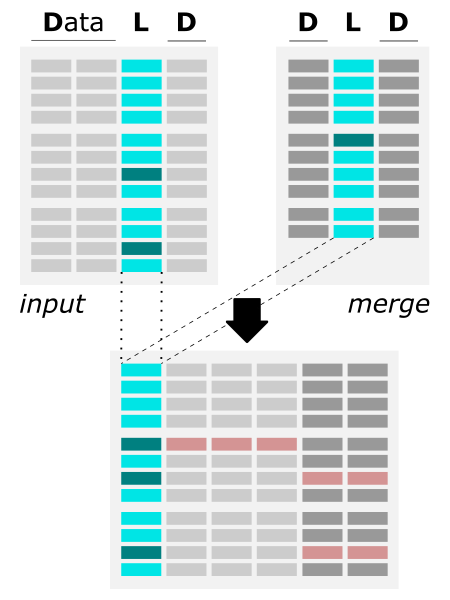

# merge_data app (python)

* [Overview](#overview)
* [App Features](#app-features)
* [Algorithm](#algorithm)
* [Requirements](#requirements)
* [Options](#options)
* [Example usage](#example-usage)
* [Hands-on tutorial](#hands-on-tutorial)

## Overview

The merge_data.py application is written in Python3 and employs an efficient pandas library for operating on a column-like data structure. The application enables the **merging of two (or more) files by matching columns** with filling in the **missing data by customized error values**. <br>

Merging files by a common column facilitates:
- creating a robust dataset from different source files
- complementing the features for observables
- finding the common part of two data sets
- detecting missing data in results

## App Features
- merging files of the same or different format, i.e., with different column headers or different column order
- merging files separated by different delimiters (including .xlsx files)
- merging multiple files all at once
- keeping only selected columns during the merge (the same or different columns from files)


## Algorithm

<table>
  <tr> <th>Schema</th> <th>Notes</th> </tr>
  <tr> <td>
        <br>
        <i>The figure shows the algorithm of merging two files by common column.</i>
       </td> <td>
        <li> all files should be a column-like text file (including Excel .xlsx format and CSV separated with different delimiters) </li>
        <li> all files should include a matching column (with the same values), but the header may be different in each file </li>
        <li> data columns from the second (and all next) files is added to the first file and automatically saved in the output file </li>
        <li> the user can customize the name of the output file </li>
        <li> if some values are missing in the merge_data file, the corresponding fields are filled with pre-set missing_value (-9999.99 by default, user can customize it) </li>
    </td> </tr>
</table>


## Requirements

Requirements: python3, pandas, openpyxl, csv

<details><summary>Install Python3 on various operating systems <i>(if you don't have it yet)</i></summary>

* Python3 - Ubuntu

```
sudo apt-get update
$ sudo apt-get install python3.
```

* Python3 - macOS

^ if not yet, install Homebrew
```
/bin/bash -c "$(curl -fsSL https://raw.githubusercontent.com/Homebrew/install/HEAD/install.sh)"
```

```
brew install python3
```

* Python3 - Windows

Please follow the instructions provided at [phoenixnap.com](https://phoenixnap.com/kb/how-to-install-python-3-windows) .
</details><br>

**Install app requirements**

```
pip3 install pandas
pip3 install openpyxl
```


## Options

help & info arguments:
```
  -h,         --help                       # show full help message and exit
```

required arguments:
```
-i files,     --input-files files          # [string] input multi-col files;
                                             comma-separated list of filenames or a column-like file containing paths & filenames of all inputs
-c mcols,     --matching-columns mcols     # list of matching columns in the input files;
                                             e.g., 1 (when all inputs in the same format) or
                                             e.g., 0,5 or label1,label2 (when inputs are different)
                                             ^col index starts from 0 [int]; or exact names of column headers
```

optional arguments:
```
--k kcols, --keep-columns kcols            # list of columns to be kept;
                                             e.g., 0,5 or label1,label2 (when all inputs in the same format) or
                                             e.g., 0,5:8 or label1,label2;label3 (when inputs are different)
                                             ^col index starts from 0 [int]; or exact names of column headers
-e missing, --error-value missing          # [any] provide custom value for missing data
-o outfile, --output-datafile outfile      # [string] provide custom name for the output data_file
-f format,  --output-format format         # [int] select format for output file: 0 - original (separator from the first input), 1 - csv, 2 - xlsx
-v val, --verbose val                      # {0, 1} select verbosity level: 0 - critical + errors + warnings; 1 - all from the level 0 + info;
```

*defaults for optional arguments:*
```
-k ''                  # means: all columns from all merging files will be kept
-e -9999.99            # means: all missing data will be replaced with -9999.99
-o 'data_output'       # means: the output will be saved as 'output_data' file
-f 0                   # means: the output will be saved in the original format (separator from the first input on the list)
-v 0                   # means: all critical, error, and warning messages will be printed on standard output
```


## Example usage

```
python3 merge_data.py -i file1,file2 -c col0
                     [-k col1,col2] [-e missing]
                     [-o outfile] [-f format]
                     [-v val] [-h]
```

*^ arguments provided in square brackets [] are optional*

**EXAMPLE INPUTS**

In the **data** folder are 3 example inputs: `input0.txt`, `input1.txt`, and `input2.txt`. The files contain information about various fruits. The column shared betwen files stores the fruit common name. The column names (headers) can differ, i.e., *'fruit', 'Fruit', and 'fruit'*, respectively. In the first and second input, it is the first column (index 0 in Python), while in the third file, this column has index 1 (second column in the file). The remaining columns provide fruit specifications, including size, weight, color, and category. Some features are repetitive among the input files. Such a simple dataset will allow us to test a complete set of **data_merge** applications in various scenarios.

|`input0.txt`|`input1.txt`|`input2.txt`|
|------------|------------|------------|
|*fruit,size(in),weight(oz)*<br>apple,4,6.8<br>blueberry,5/8,0.02<br>orange,4,4.6<br>lemon,3,3.5<br>...|*Fruit,weight(g),color,category*<br>apple,195,green,apples & pears<br>blueberry,0.5,blue,berries<br>orange,130,orange,citrus<br>lemon,100,yellow,citrus<br>...|*index,fruit,color*<br>0,apple,green<br>1,blueberry,blue<br>2,orange,orange<br>3,lemon,yellow<br>...|

* **[1] example usage with minimal required options:**

The minimal required option include providing names of input files and indexes (or names) of matching (shared) columns. Let's use the two first inputs, providing their names as a comma-separated list with the option `-i`. In both files, the common column (with all unique values!) is the first column, specifying the name of the fruit. Since the index of this column in both files is the same, provide it with the `-c` option as a single integer value.

run in the terminal:
```
python3 merge_data.py -i input0.txt,input1.txt -c 0
```

equal using all default options:

```
python3 merge_data.py -i input0.txt,input1.txt -c 0 -k '' -e -9999.99 -o 'data_output' -f 0 -v 0
```

The algorithm merges two input files using a common column (with index 0) to match the data corresponding to the entry (here: fruit). All the data columns are kept from both files (option `-k ''`). The data is combined in the 'outer' scheme. Thus the result will be the sum of the sets from both inputs. Missing data in the merged entry is replaced by the default error value (option `-e -9999.99`). The merged data is saved to the *data_output-{data_stamp}* file with option `-o`, and output format matches the separator from the first-provided input (option `-f 0`). The app logger, during the calculations, prints info about all critical, error, and warning events to standard output.

**STANDARD OUTPUT**

```
0 input0.txt
1 input1.txt
```

**OUTPUT FILE:** `data_output-{data_stamp}`

```
,fruit_0,size(in)_0,weight(oz)_0,weight(g)_1,color_1,category_1
0,apple,4,6.8,195.0,green,apples & pears
1,blueberry,5/8,0.02,0.5,blue,berries
2,orange,4,4.6,130.0,orange,citrus
3,lemon,3,3.5,100.0,yellow,citrus
...
```
Note the column names in the output file are altered by adding the suffix (*_N*) corresponding to the index of the input from which the column is derived. The pairs of inputs and assigned indexes are printed to the standard output for easy reference. That allows easy identification of data when the input format is the same (i.e., column headers; *here: both inputs contain a 'weight' column*).


* **[2] example usage when matching columns have different indexes:**

Sometimes, you need to merge by a common column two files of different format. It means the files differ in the number of columns, order of columns, and/or headers of the corresponding columns. This scenario is matched by the example inputs: `input0.txt` and `input2.txt` (different columns order) or `input1.txt` and `input2.txt` (different column names). So, you need to specify the matching columns in both files and provide them in the same order as the inputs. You can either enter column indexes or column headers.

**A.** provide column indexes:
```
python3 merge_data.py -i input0.txt,input2.txt -c 0,1
```

<details><summary>see outputs</summary>

*standard output*
```
0 input0.txt
1 input2.txt
```
`data_output` *file content*
```
,fruit_0,size(in)_0,weight(oz)_0,index_1,color_1
0,apple,4,6.8,0,green
1,blueberry,5/8,0.02,1,blue
2,orange,4,4.6,2,orange
3,lemon,3,3.5,3,yellow
...
```
</details><br>

**B.** provide column headers:
```
python3 merge_data.py -i input1.txt,input2.txt -c Fruit,fruit
```

<details><summary>see outputs</summary>

*standard output*
```
0 input1.txt
1 input2.txt
```
`data_output` *file content*
```
,Fruit_0,weight(g)_0,color_0,category_0,index_1,color_1
0,apple,195.0,green,apples & pears,0.0,green
1,blueberry,0.5,blue,berries,1.0,blue
2,orange,130.0,orange,citrus,2.0,orange
3,lemon,100.0,yellow,citrus,3.0,yellow
...
```
</details><br>

**C.** when the column header is the same for all inputs (even if the indexes are different), you can provide it as a single value:
```
python3 merge_data.py -i input0.txt,input2.txt -c fruit
```

*^ the same outputs as in example A*


<i>In examples <b>A, B,</b> and <b>C</b> </i>, all the remaining settings are default, so all data columns from all inputs are kept, and the value of <i>-9999.99</i> is assigned to all missing data. See <b>[1] example usage with minimal required options</b> to learn more about the default settings.

* **[3] example usage of merging multiple files, all in the same format:**

To merge any number of files in the same format, simply expand the input list.

**A.** If the list of files is finitely short (say, less than 5), list their names separated by a comma:

```
python3 merge_data.py -i input0.txt,input0.txt,input0.txt,input0.txt,input0.txt -c 0
```

*^ Yes, you can merge/multiply the content of the same input file too, if needed.*

<details><summary>see outputs</summary>

*standard output*
```
0 input0.txt
1 input0.txt
2 input0.txt
3 input0.txt
4 input0.txt
```
`data_output` *file content*
```
,fruit_0,size(in)_0,weight(oz)_0,size(in)_1,weight(oz)_1,size(in)_2,weight(oz)_2,size(in)_3,weight(oz)_3,size(in)_4,weight(oz)_4
0,apple,4,6.8,4,6.8,4,6.8,4,6.8,4,6.8
1,blueberry,5/8,0.02,5/8,0.02,5/8,0.02,5/8,0.02,5/8,0.02
2,orange,4,4.6,4,4.6,4,4.6,4,4.6,4,4.6
3,lemon,3,3.5,3,3.5,3,3.5,3,3.5,3,3.5
...
```
</details><br>

**B.** If the number of files is large (say, more than 5), use a 1-column file listing all the inputs.

First, list the paths & names of all inputs in a one-column file. *For example, go to the directory with all inputs and execute the command:*
```
for i in input*; do echo `pwd`/$i >> input_list; done
```

*preview of the example* `input_list`:
```
/Users/abadacz/REPOS/GIF/data_wrangling/merge_data/data/input0.txt
/Users/abadacz/REPOS/GIF/data_wrangling/merge_data/data/input0.txt
/Users/abadacz/REPOS/GIF/data_wrangling/merge_data/data/input0.txt
/Users/abadacz/REPOS/GIF/data_wrangling/merge_data/data/input0.txt
/Users/abadacz/REPOS/GIF/data_wrangling/merge_data/data/input0.txt
/Users/abadacz/REPOS/GIF/data_wrangling/merge_data/data/input0.txt
```

Then, use the `inputs_list` as the argument of the `-i` option:

```
python3 merge_data.py -i input_list -c 0
```

<details><summary>see outputs</summary>

*standard output*
```
0 /Users/abadacz/REPOS/GIF/data_wrangling/merge_data/data/input0.txt
1 /Users/abadacz/REPOS/GIF/data_wrangling/merge_data/data/input0.txt
2 /Users/abadacz/REPOS/GIF/data_wrangling/merge_data/data/input0.txt
3 /Users/abadacz/REPOS/GIF/data_wrangling/merge_data/data/input0.txt
4 /Users/abadacz/REPOS/GIF/data_wrangling/merge_data/data/input0.txt
5 /Users/abadacz/REPOS/GIF/data_wrangling/merge_data/data/input0.txt
```
`data_output` *file content*
```
,fruit_0,size(in)_0,weight(oz)_0,size(in)_1,weight(oz)_1,size(in)_2,weight(oz)_2,size(in)_3,weight(oz)_3,size(in)_4,weight(oz)_4,size(in)_5,weight(oz)_5
0,apple,4,6.8,4,6.8,4,6.8,4,6.8,4,6.8,4,6.8
1,blueberry,5/8,0.02,5/8,0.02,5/8,0.02,5/8,0.02,5/8,0.02,5/8,0.02
2,orange,4,4.6,4,4.6,4,4.6,4,4.6,4,4.6,4,4.6
3,lemon,3,3.5,3,3.5,3,3.5,3,3.5,3,3.5,3,3.5
...
```
</details><br>


* **[4] example usage of merging multiple files of different formats:**

To merge any number of files in a few different formats, simply (1) expand the input list, and (2) specify the matching columns from **all** inputs. *See the previous example to learn how to smartly and effortlessly enter a long list of inputs (1).* The corresponding matched columns need to be provided directly in an ordered manner as a comma-separated list of column indexes or column headers. The length of that list must match the number of inputs. Also, **no field** in the list can be empty (e.g., *0,,0,1,2*).

Let's assume the list of inputs is stored in the `inputs_list` file:

```
/Users/abadacz/REPOS/GIF/data_wrangling/merge_data/data/input0.txt
/Users/abadacz/REPOS/GIF/data_wrangling/merge_data/data/input1.txt
/Users/abadacz/REPOS/GIF/data_wrangling/merge_data/data/input2.txt
```

Then, use this file with the option `-i` and specify the index (or name) of the matching column in the same order:

```
python3 merge_data.py -i input_list -c 0,0,1
```
or
```
python3 merge_data.py -i input_list -c fruit,Fruit,fruit
```


<details><summary>see outputs</summary>

*standard output*
```
0 /Users/abadacz/REPOS/GIF/data_wrangling/merge_data/data/input0.txt
1 /Users/abadacz/REPOS/GIF/data_wrangling/merge_data/data/input1.txt
2 /Users/abadacz/REPOS/GIF/data_wrangling/merge_data/data/input2.txt
```
`data_output` *file content*
```
,fruit_0,size(in)_0,weight(oz)_0,weight(g)_1,color_1,category_1,index_2,color_2
0,apple,4,6.8,195.0,green,apples & pears,0.0,green
1,blueberry,5/8,0.02,0.5,blue,berries,1.0,blue
2,orange,4,4.6,130.0,orange,citrus,2.0,orange
3,lemon,3,3.5,100.0,yellow,citrus,3.0,yellow
...
```
</details><br>

* **[5] example usage of grabbing selected columns only while merging inputs:**

You might have noticed that some columns are redundant between example inputs (*e.g., weight or color*). You can choose whether to keep all repetitions or only selected ones from a given file. You can also drop other columns that are not interesting for your further analysis. All operations to keep only select columns uses with the `-k` option. The syntax of its arguments is very similar to the `-c` option, where you specified matching columns. In this case, you can select multiple columns from a single input. The columns to keep from a given input are separated by a comma, while the lists for subsequent inputs are separated by a colon. The order must correspond to the order of inputs. An empty value corresponding to a given input means that all columns will be kept.

Let's use the `input_list` from example 4.

**A.** keep a single column (of the same index) from every input:
```
python3 merge_data.py -i input_list -c 0,0,1 -k 2
```

<details><summary>see outputs</summary>

*standard output*
```
0 /Users/abadacz/REPOS/GIF/data_wrangling/merge_data/data/input0.txt
1 /Users/abadacz/REPOS/GIF/data_wrangling/merge_data/data/input1.txt
2 /Users/abadacz/REPOS/GIF/data_wrangling/merge_data/data/input2.txt
```
`data_output` *file content*
```
,fruit_0,weight(oz)_0,color_1,color_2
0,apple,6.8,green,green
1,blueberry,0.02,blue,blue
2,orange,4.6,orange,orange
3,lemon,3.5,yellow,yellow
...
```
</details><br>

**B.** keep a single column (of the same name) from every input:
```
python3 merge_data.py -i input_list -c 0,0,1 -k color
```

<details><summary>see outputs</summary>

*standard output*
```
0 /Users/abadacz/REPOS/GIF/data_wrangling/merge_data/data/input0.txt
1 /Users/abadacz/REPOS/GIF/data_wrangling/merge_data/data/input1.txt
2 /Users/abadacz/REPOS/GIF/data_wrangling/merge_data/data/input2.txt

WARNING:root:The provided columns: ['color'] expected to be kept from the /Users/abadacz/REPOS/GIF/data_wrangling/merge_data/data/input0.txt file are incorrect and can NOT be merged into output. Please check your files.
```
`data_output` *file content*
```
,fruit_0,color_1,color_2
0,apple,green,green
1,blueberry,blue,blue
2,orange,orange,orange
3,lemon,yellow,yellow
...
```

*Note the `input0.txt` does not contain the 'weight' column, so that's why the warning message appeared.*
</details><br>

**C.** select multiple columns (of the same indexes or names) from every input:
```
python3 merge_data.py -i input_list -c 0,0,1 -k 0,2-3,color
```

*^ Note you can specify individual columns separated by commas or provide dash-separated ranges of indexes. You can also mix indexes and names in the requested list. If a column with a given index or name does not exist in some inputs, it will simply be ignored (with warnings returned on the standard output).*

<details><summary>see outputs</summary>

*standard output*
```
0 /Users/abadacz/REPOS/GIF/data_wrangling/merge_data/data/input0.txt
1 /Users/abadacz/REPOS/GIF/data_wrangling/merge_data/data/input1.txt
2 /Users/abadacz/REPOS/GIF/data_wrangling/merge_data/data/input2.txt

WARNING:root:The provided columns: ['color'] expected to be kept from the /Users/abadacz/REPOS/GIF/data_wrangling/merge_data/data/input0.txt file are incorrect and can NOT be merged into output. Please check your files.
```
`data_output` *file content*
```
,fruit_0,weight(oz)_0,color_1,category_1,index_2,color_2
0,apple,6.8,green,apples & pears,0.0,green
1,blueberry,0.02,blue,berries,1.0,blue
2,orange,4.6,orange,citrus,2.0,orange
3,lemon,3.5,yellow,citrus,3.0,yellow
...
```
</details><br>

**D.** select different columns from various inputs:

*^ useful when merging files of different formats/content*

```
python3 merge_data.py -i input_list -c 0,0,1 -k 1:1-3:index
```

<details><summary>see outputs</summary>

*standard output*
```
0 /Users/abadacz/REPOS/GIF/data_wrangling/merge_data/data/input0.txt
1 /Users/abadacz/REPOS/GIF/data_wrangling/merge_data/data/input1.txt
2 /Users/abadacz/REPOS/GIF/data_wrangling/merge_data/data/input2.txt
```
`data_output` *file content*
```
,fruit_0,size(in)_0,weight(g)_1,color_1,category_1,index_2
0,apple,4,195.0,green,apples & pears,0.0
1,blueberry,5/8,0.5,blue,berries,1.0
2,orange,4,130.0,orange,citrus,2.0
3,lemon,3,100.0,yellow,citrus,3.0
...
```
</details><br>

*^ If you want to grab different columns from different inputs, you need to provide a colon-separated list of the length corresponding to the number of inputs. Each entry of that list is a comma-separated list of individual columns from the corresponding input. All rules from the example C apply.*

* **[6] example usage with customized value for missing data:**

```
python3 merge_data.py -i input0.txt,input1.txt -c 0 -e "missing"
```

*The example parses two column-like files (input_file and merge_file), where the common column has index = 0 in the first file, and index = 0 in the second file. The missing data will be replaced with the <b>customized error value = 'missing'</b>. The merged results will be saved into the default 'data_output-$date' file.*

* **[7] example usage with customized name of output file:**

```
python3 merge_data.py -i input0.txt,input1.txt -c 0 -o my_merged_data
```

*The example parses two column-like files (input_file and merge_file), where the common column has index = 0 in the first file, and index = 0 in the second file. The missing data will be replaced with the default error value = -9999.99. The merged results will be saved into the customized 'my_merged_data' file.*

* **[8] example usage with Excel format of output file:**

```
python3 merge_data.py -i input0.txt,input1.txt -c 0 -f 2
```

*The example parses two column-like files (input_file and merge_file), where the common column has index = 0 in the first file, and index = 0 in the second file. The missing data will be replaced with the default error value = -9999.99. The merged results will be saved into the default 'data_output-$date.xlsx' file in Excel format (option `-f 2`).*

* **[9] fully customized example usage with user-provided value for missing data and output filename saved in CSV format:**

```
python3 merge_data.py -i input0.txt,input1.txt -c 0 -k 1,2:2-3 -e missing -o my_merged_data -f 1 -v 1
```

*The example parses two column-like files (input_file and merge_file), where the common column has index = 0 in the first file, and index = 0 in the second file. From the first file columns with the index 1 and 2 will be kept. From the second file columns between indexes 2 and 3 will be kept. The missing data will be replaced with the <b>customized error value = 'missing'</b>. The merged results will be saved into the customized 'my_merged_data.csv' file in CSV format. During calculation the 'INFO' level verbosity will be printed to standard output.*


## Hands-on tutorial

<a href="https://datascience.101workbook.org/07-DataParsing/03-DATA-WRANGLING-APPS/01-merge-data-py" target="_blank">DataScience_Workbook/07. Data Acquisition and Wrangling/Data Wrangling/<b>Merge files by common column</b>  ⤴</a>
